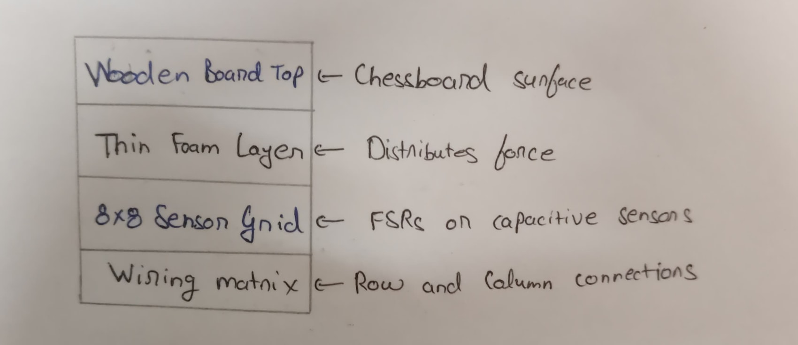
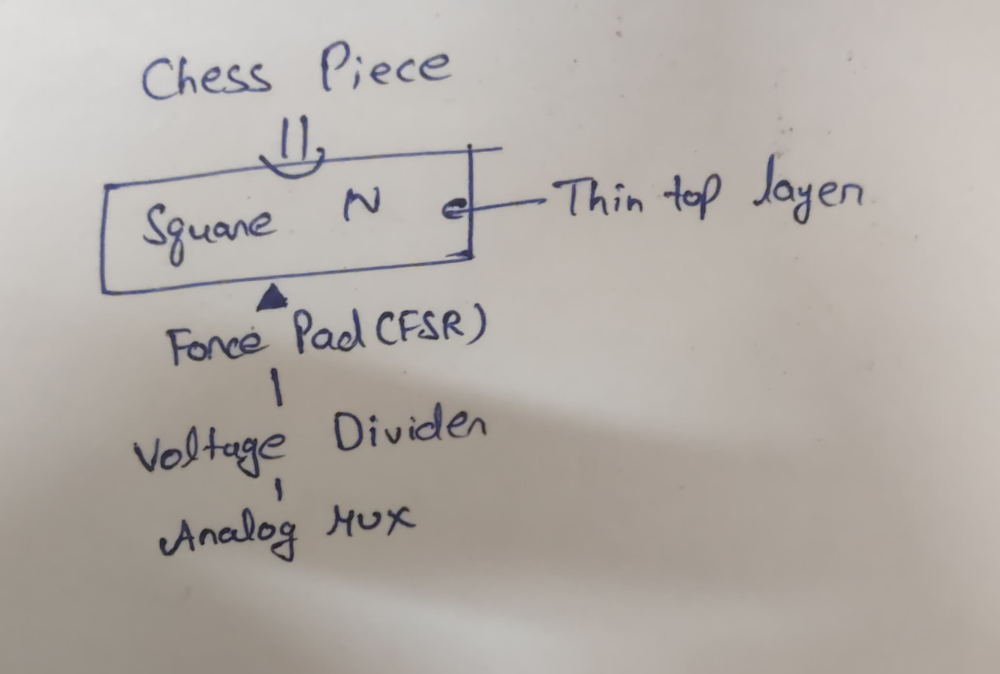

# Task A

## Methods to be considered other than CV, RFID, and magnetic sensors
- **Chess pieces with conductive material and Resistive Grid** 
- **IR Reflective sensors**
- **Force Sensitive Resistors(FSRs)**

## Why we should prefer FSRs over other two
- **Conductive material and Resistive Grid:** 1. Reliability is low as it is suspectible to noise, pressure variance and accidental contact whereas for FSRs, it is high as they degrade slowly.
 2. FSR is easier to wire as matrix while custom PCM or layered board might be tricky.
 3. It is easier to identify a bad sensor in FSR while the entire board may need reworking in case of the resistive grid.

- **IR Reflective Sensors:** 1. Firstly, Dark/matte piece bases reflect less IR which is a challenge to look out for.
 2. Too many IR sensors will require a huge power draw.

## What exactly is a FSR
A FSR is a sensor that detects physical pressure, squeezing, and weight by changing its electrical resistance in response to applied force.
FSR consists of a conductive polymer layer sandwiched between two electrodes. When pressure is applied, the polymer's resistance changes, indicating the amount of force. 
**Working principle:** A FSR is placed beneath each square. When a piece is on the square, the pressure from the weight causes the FSR to output a lower resistance(i.e., measurable analog voltage). And, when the piece is lifted, pressure drops, so voltage increases or resistance rises, and we detect the activation.

## How we'll setup different components for the task
### FSR Placement
- Each of the 64 squares on the board has one FSR installed directly under it.
- When a chess piece rests on a square, it applies pressure on the FSR → lower resistance. When the piece is lifted → pressure released → resistance increases sharply.
### Voltage Divider Setup
- Each FSR is part of a voltage divider circuit to convert resistance change into a measurable voltage.
- Output voltage from the divider is read by a microcontroller (e.g., Arduino).
- When voltage crosses a pre-defined threshold (e.g., >2V), it indicates that the piece has been lifted

## Why this method works well
- No need for vision/RFID/magnets
- Simple analog hardware, so it is cheap and easy to prototype
- It is highly sensitive, so it detects even light changes in pressure
- It has universal piece detection so it can detect any piece on the 64 squared board.

# Task B

## 16-Pin Approach
### 8×8 Matrix Scanning (Multiplexed Grid Layout)
We arrange the 64 sensors in an 8x8 matrix. Instead of connecting each sensor to a unique pin (which would require 64 pins), we organize the sensors so that:
Rows (8) are connected to 8 Arduino output pins Columns (8) are connected to 8 Arduino input pins → Only 16 pins needed instead of 64.
**How it works:** 
- Matrix Wiring: Each sensor sits at the intersection of a row and column wire:
One terminal of the sensor connects to a row line.
The other terminal connects to a column line.
- Scanning Logic to detect activation:
Set one row HIGH at a time (others LOW). Read all column pins.
- If a column pin reads HIGH, it means the sensor at that (row, column) is active (piece was lifted).
- Repeat this process for all 8 rows to scan the whole board.
This is called row-column scanning, commonly used in keypads and LED matrices.
- Debouncing & Timing: Implement a debounce routine to filter noise. Add scan delay (a few milliseconds) between rows.

## 7-Pin Approach
### Using Multiplexers (MUX) or Shift Registers
To efficiently detect which square on a chessboard has been activated (i.e., when a piece is lifted), we use a method that significantly reduces the number of required Arduino I/O pins. Instead of assigning a dedicated pin to each of the 64 squares, we implement a matrix scanning technique using two 8-to-1 multiplexers (CD4051) in combination with FSRs (Force Sensitive Resistors) placed under each square. This setup allows us to detect individual activations using just 7 pins on the Arduino.
**How It Works:**
- Two 8-channel multiplexers are used: one for selecting rows (outputs) and one for columns (inputs), controlled via 3 digital pins each.
- Each FSR connects between a unique row and column pair, forming an 8×8 matrix of sensors.
- A single analog pin reads the voltage from the selected row-column combination to detect changes in resistance when a piece is lifted.
- The Arduino scans all possible (row, column) combinations by cycling through select signals, and identifies the active square based on a threshold in sensor value.

